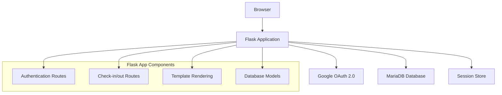
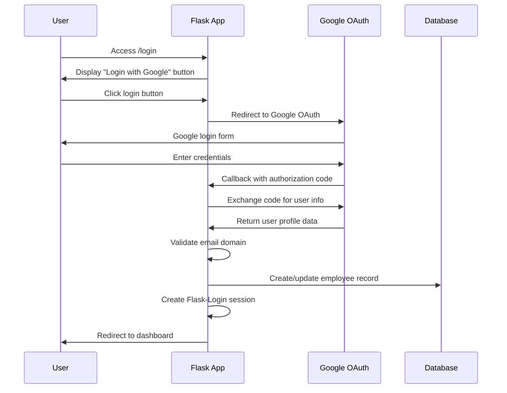

# Design Document

## Overview

The Employee Check-in System is a Flask-based web application that provides secure time tracking functionality for employees using Google Workspace authentication. The system follows a simple three-tier architecture with a clean separation between presentation, business logic, and data persistence layers.

### Key Design Principles
- **Simplicity First**: Minimal complexity, focusing on core functionality
- **Security by Design**: Domain-restricted OAuth with secure session management
- **Iterative Development**: Modular components that can be built incrementally
- **Clean Code**: Readable, maintainable Flask patterns

## Architecture

### High-Level Architecture



### Technology Stack
- **Backend**: Python 3.x + Flask Framework
- **Database**: MariaDB with PyMySQL connector
- **Authentication**: Google OAuth 2.0 via Authlib
- **Session Management**: Flask-Login + Flask sessions
- **Frontend**: HTML templates with Pico.css framework
- **Configuration**: python-dotenv for environment management

## Components and Interfaces

### 1. Application Structure

```
/employee-checkin-app
├── app.py                 # Main Flask application
├── .env                   # Environment configuration
├── requirements.txt       # Python dependencies
├── static/
│   └── style.css         # Additional CSS customizations
└── templates/
    ├── layout.html       # Base template with navigation
    ├── login.html        # Google OAuth login page
    └── index.html        # Main dashboard after login
```

### 2. Flask Application Components

#### Core Application (app.py)
```python
# Key components structure
class Config:
    # Environment-based configuration management
    
class Employee:
    # User model for Flask-Login integration
    
# Route handlers:
# - /login (GET): Display login page
# - /auth/google (GET): Initiate Google OAuth
# - /auth/callback (GET): Handle OAuth callback
# - / (GET): Main dashboard
# - /check-in (POST): Record check-in time
# - /check-out (POST): Record check-out time
# - /logout (GET): Clear session and logout
```

#### Database Connection Management
```python
# Connection pooling and error handling
class DatabaseManager:
    def get_connection(self):
        # PyMySQL connection with retry logic
        
    def execute_query(self, query, params):
        # Safe query execution with proper error handling
        
    def close_connection(self):
        # Clean connection cleanup
```

### 3. Authentication Flow

#### Google OAuth Integration


#### Domain Validation Logic
```python
def validate_company_domain(email):
    """
    Validates that user email belongs to company domain
    Returns: (is_valid: bool, error_message: str)
    """
    company_domain = os.getenv('HOSTED_DOMAIN')
    user_domain = email.split('@')[1]
    return user_domain == company_domain
```

### 4. Check-in/Check-out Logic

#### Daily Attendance State Management
```python
class AttendanceStatus:
    NOT_CHECKED_IN = "not_checked_in"
    CHECKED_IN = "checked_in" 
    COMPLETED = "completed"

def get_today_attendance_status(employee_id):
    """
    Determines current attendance status for today
    Returns: AttendanceStatus enum value
    """
```

#### Business Rules
- **One check-in per day**: Prevent duplicate check-ins for same work_date
- **Sequential operations**: Check-out only allowed after check-in
- **Timezone handling**: All timestamps stored in server timezone
- **Date boundaries**: Work_date based on server date, not timestamp date

## Data Models

### Database Schema

#### Employees Table
```sql
CREATE TABLE employees (
    id INT AUTO_INCREMENT PRIMARY KEY,
    google_id VARCHAR(255) NOT NULL UNIQUE,
    email VARCHAR(255) NOT NULL UNIQUE,
    name VARCHAR(255),
    picture_url VARCHAR(255),
    created_at TIMESTAMP DEFAULT CURRENT_TIMESTAMP,
    INDEX idx_google_id (google_id),
    INDEX idx_email (email)
);
```

#### Attendances Table
```sql
CREATE TABLE attendances (
    id INT AUTO_INCREMENT PRIMARY KEY,
    employee_id INT NOT NULL,
    check_in_time DATETIME NOT NULL,
    check_out_time DATETIME NULL,
    work_date DATE NOT NULL,
    created_at TIMESTAMP DEFAULT CURRENT_TIMESTAMP,
    FOREIGN KEY (employee_id) REFERENCES employees(id) ON DELETE CASCADE,
    UNIQUE KEY unique_daily_checkin (employee_id, work_date),
    INDEX idx_employee_date (employee_id, work_date),
    INDEX idx_work_date (work_date)
);
```

### Data Access Layer

#### Employee Operations
```python
class EmployeeRepository:
    def find_by_google_id(self, google_id): pass
    def find_by_email(self, email): pass
    def create_or_update(self, google_user_info): pass
```

#### Attendance Operations
```python
class AttendanceRepository:
    def get_today_attendance(self, employee_id): pass
    def create_checkin(self, employee_id): pass
    def update_checkout(self, employee_id): pass
    def get_recent_history(self, employee_id, days=14): pass
```

## Error Handling

### Authentication Errors
- **Invalid domain**: Clear message directing to use company email
- **OAuth failures**: Graceful fallback with retry option
- **Session expiry**: Automatic redirect to login with context preservation

### Database Errors
- **Connection failures**: Retry logic with exponential backoff
- **Constraint violations**: User-friendly messages for duplicate operations
- **Transaction rollbacks**: Ensure data consistency on failures

### Application Errors
- **Missing environment variables**: Startup validation with clear error messages
- **Template rendering errors**: Fallback error pages
- **Route not found**: Custom 404 pages with navigation back to main app

## Testing Strategy

### Unit Testing Approach
```python
# Test categories and key test cases:

class TestAuthentication:
    def test_valid_company_domain_acceptance()
    def test_invalid_domain_rejection()
    def test_oauth_callback_handling()

class TestAttendanceLogic:
    def test_first_checkin_of_day()
    def test_prevent_duplicate_checkin()
    def test_checkout_after_checkin()
    def test_prevent_checkout_without_checkin()

class TestDatabaseOperations:
    def test_employee_creation_and_updates()
    def test_attendance_record_creation()
    def test_attendance_history_retrieval()
```

### Integration Testing
- **OAuth flow end-to-end**: Mock Google OAuth responses
- **Database transactions**: Test rollback scenarios
- **Session management**: Verify login persistence and logout

### Manual Testing Scenarios
- **Happy path**: Complete check-in/check-out cycle
- **Edge cases**: Multiple login attempts, browser refresh during OAuth
- **Error scenarios**: Database unavailable, invalid OAuth responses

## Security Considerations

### Authentication Security
- **OAuth state parameter**: Prevent CSRF attacks during OAuth flow
- **Session security**: Secure session cookies with proper flags
- **Domain validation**: Server-side verification of email domains

### Data Protection
- **SQL injection prevention**: Parameterized queries throughout
- **XSS protection**: Template auto-escaping enabled
- **HTTPS enforcement**: Redirect HTTP to HTTPS in production

### Environment Security
- **Secrets management**: All sensitive data in environment variables
- **Database credentials**: Separate database user with minimal privileges
- **OAuth credentials**: Proper redirect URI validation

## Performance Considerations

### Database Optimization
- **Indexing strategy**: Optimized indexes for common query patterns
- **Connection pooling**: Efficient database connection management
- **Query optimization**: Minimize N+1 queries in attendance history

### Caching Strategy
- **Session caching**: Efficient session storage and retrieval
- **Static assets**: Proper cache headers for CSS/JS files
- **Database query caching**: Cache frequently accessed employee data

### Scalability Planning
- **Stateless design**: Application can scale horizontally
- **Database partitioning**: Future partitioning strategy for attendance data
- **CDN readiness**: Static assets can be moved to CDN if needed